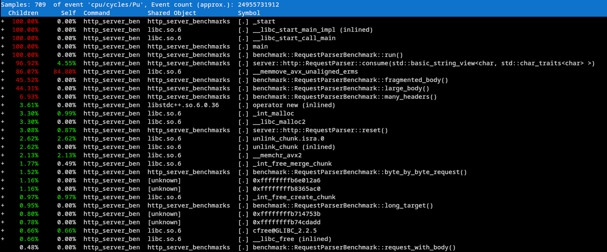
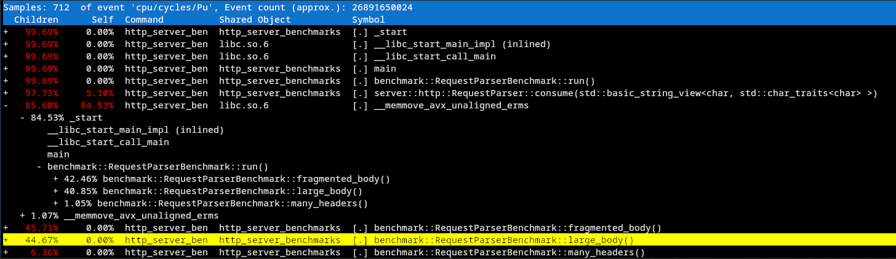

# Benchmarking, Profiling, Iterating: The Lifecycle of Performance
*Optimizing a Modern C++ HTTP Parser with `perf`*

## Preface

The analysis and optimization happening in this post is on the HTTP server project I've been building. I chose this as my first serious and long-term project for two reasons.

First, it is a good way to exercise the modern C++ I've been studying in my free time. The second reason is that I wanted to learn the process of optimizing software.

My reasoning for the second point is that HTTP servers are mature and well-understood software with decades of documentation and resources surrounding them. This is especially useful when researching the different layers involved, from HTTP request formatting to POSIX sockets and operating-system behavior.

Because the problem space is so well documented, I can focus less on inventing the system itself and more on understanding how each layer works, measuring its behavior, and learning how to improve it.

## Establishing a Baseline

I chose to focus the initial benchmarking effort on the request parser because, in the current version of the server, it is by far the most complex and computationally demanding component. The networking layer mostly wraps relatively direct POSIX socket operations, while the parser has to maintain state across calls, identify request boundaries, validate syntax, process headers, handle request bodies, and correctly deal with input arriving in arbitrary fragments. It also performs much more string and memory manipulation than the other parts of the server.

Because of that, the parser seemed like the most useful place to establish a performance baseline and look for optimization opportunities.

To begin, I implemented my own benchmarking suite focused on specific parser workloads and used `std::chrono::steady_clock` to measure their execution time.

Rather than benchmarking only a single ideal request, I created several workloads designed to exercise different behaviors of the parser. An HTTP request may arrive all at once, in several fragments, or even one byte at a time depending on how data is delivered over the network. Requests can also vary significantly in size and structure.

The benchmark suite included the following cases:

| Benchmark | Purpose |
|---|---|
| `lifecycle` | Measures the full lifecycle of creating, using, and resetting a parser. |
| `complete_request` | Feeds a normal HTTP request to the parser in a single operation. |
| `fragmented_request` | Splits a request across multiple calls to `consume()`, simulating data arriving in several chunks. |
| `byte_by_byte_request` | Feeds the request to the parser one byte at a time, representing an intentionally extreme fragmentation case. |
| `malformed_request` | Measures how quickly the parser recognizes and rejects invalid input. |
| `request_with_body` | Exercises parsing when the request contains a body rather than only headers. |
| `many_headers` | Tests the cost of processing a request containing a larger number of HTTP headers. |
| `large_body` | Tests the parser with a significantly larger request body. |
| `fragmented_body` | Combines a larger request body with incremental delivery of that body. |
| `long_target` | Tests a request containing a much longer request target than the typical case. |

I wasn't trying to reproduce every possible HTTP request. The purpose of these benchmarks was to create a small collection of workloads that stressed different behaviors in the parser.

The fragmentation benchmarks were especially important because the parser is incremental. It needs to preserve its state when only part of a request is available and continue parsing once more data arrives.

For each workload, I ran a large number of iterations and collected multiple samples. From those samples I calculated the mean, median, minimum, maximum, standard deviation, 95th and 99th percentiles, and operations per second. This gave me more information than a single average and made it easier to compare both typical performance and variation between runs.

I could have used an existing C++ benchmarking library, but part of the purpose of this project is understanding the tooling surrounding systems software rather than treating it as a black box. Building the small benchmark harness myself gave me experience with timing, repeated sampling, basic statistics, and storing benchmark results for later comparisons.

At this point I had a baseline, but the benchmark results could only tell me which workloads were slower. They could not tell me why.

To answer that, I needed to look deeper into what the CPU was actually doing.

## Investigating with `perf`

With baseline statistics from the benchmarks, I could continue the performance investigation using `perf`, specifically `perf record`.

`perf` is a Linux performance analysis tool that can sample hardware and software events while a program is running. While my benchmark suite tells me **how long** a workload takes, profiling with `perf` can help show me **where the CPU is spending its time**.

I recorded the benchmark suite and opened the resulting profile with `perf report`. One result immediately stood out: `__memmove_avx_unaligned_erms`, an optimized implementation of `memmove` provided by glibc, accounted for roughly 85% of the sampled CPU cycles.

This did not immediately tell me what was wrong with my parser. `memmove` simply moves a range of bytes from one memory location to another while correctly handling overlapping regions.

The more useful question was:

**Why was my parser causing so much memory to be moved in the first place?**

Expanding the call graph showed that most of the samples attributed to `memmove` were coming from the `large_body` and `fragmented_body` benchmarks.

This gave me a much narrower area of the parser to investigate.

The profiler had shown me what operation was consuming CPU time and which workloads were responsible for most of it. What it had not yet told me was which part of my implementation was causing those memory moves.

## Tracing the Bottleneck Back to the Parser

At this point, I knew what operation was consuming CPU time and which workloads were causing it. The next step was to inspect the parser implementation and determine what could be triggering repeated calls to `memmove`.

## Benchmarking the New Design

## Conclusion: What I Learned
